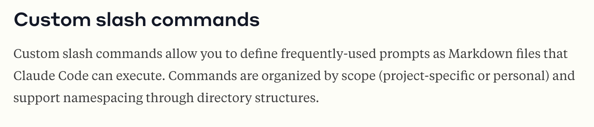
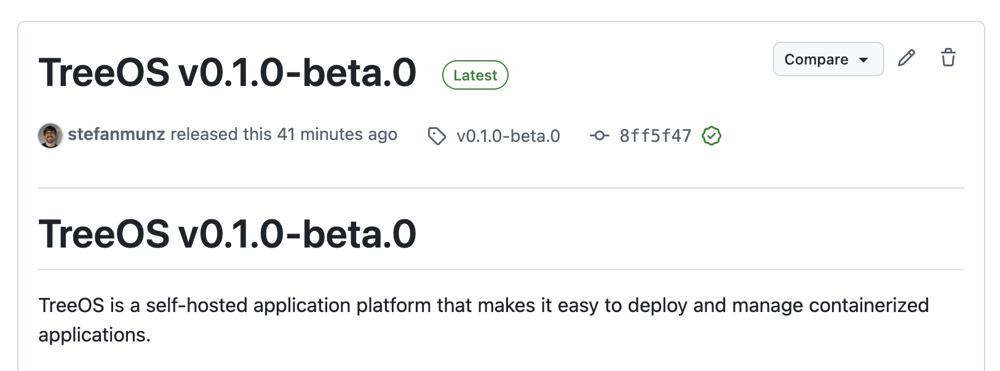
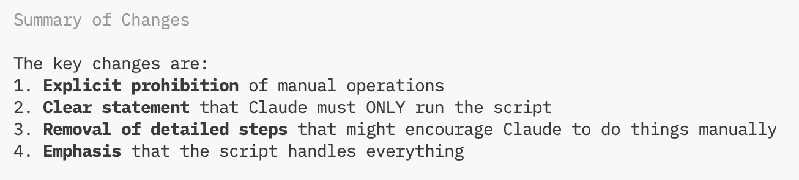

Today I'm taking you on a field trip on how I built my first two [custom slash commands](https://docs.claude.com/en/docs/claude-code/slash-commands#custom-slash-commands) for Claude Code.

I apparently slept under a rock regarding custom slash commands since they've been available for a long time. Boris Cherny mentioned them in a [video I linked earlier](https://youtu.be/iF9iV4xponk?si=XcbixQ-oiwUNacmg&t=708), which made me aware.

The first custom command I wrote last week is named [/make-ci-happy](https://gist.github.com/stefanmunz/af2269b4ad937372d4c0d9e3f5b0068b). It's a simple prompt that informs the agent how to run all the tests on Ci locally. It also gives guardrails on what to fix and escalate back to me. Because this isn't Claude's standard behavior, it became a repetitive task I had to carefully repeat every time before committing. It's of course highly tailored to this repository, so it's a custom / command only available here. It's an elegant system to have slash commands available on your machine, or only per repository.

So this is nice and helps me every day a little bit. But I wanted to see how far I can take this. I'm getting nearer to the public release of my TreeOS open source software. It's written in Go and compiles to a binary for macOS and Linux. It has a [self-update mechanism](https://github.com/minio/selfupdate) built in. Most mechanisms use a JSON on a server, which the binary queries. It's better to control this JSON and not rely on the GitHub releases page. My repository's source code isn't ready, and I haven't settled on a license. Still, I want to test the update mechanism first. This is possible via a second public repository and some GitHub Actions magic. It builds the release in one repository but pushes the artifacts to another. At the same time, the JSON needs to be updated, which lies in a different repository. For new stable releases I want to adapt the JSON and add a blog post. If this sounds complicated, it is. The perfect problem to automate via custom slash commands.

The best way to build custom slash commands is to ask Claude Code to build them. Ask it to read the documentation first, because the knowledge about slash commands isn't in the model. I named this command /treeos-release to create a namespace for my custom commands and made it available on my whole system. The paths to the needed repositories are hardcoded inside the script.

You might think this isn't proper engineering with hardwiring it to one system. Probably you're right. Since I don't see the need to run the script elsewhere than on my computer, it's fine for now. One of the main advantages of working with Coding Agents is everything can be more fluid and brittle in the beginning. I can make it more stable later, if needed.

Thee Result? Within a few minutes, I had a script. It didn't work correctly. I reported this to Claude, who fixed it. On the second try, I shipped the first beta to the public repository. Yay!

Upon closer inspection, it fell apart again. For further testing, I continued creating a stable release on top of the beta release. This failed, and it turned out the first invocation of the slash command hadn't used the created script at all. Claude Code had done it all by itself! We modified it together and added the following warning:

In short, it needed a few more repetitions until I was happy with the script. I ended up splitting it into multiple scripts, because making Claude Code patiently wait for CI is hard. Overall, it's an interesting work style, because Claude can finish the work of a half-baked script if needed. This allows iterative improvement of the script while continuing with the main work.

I highly recommend custom slash commands. It's a well-thought-out system that integrates nicely into Claude Code. Creating and debugging the slash commands are easy. Start with your most repetitive tasks, ensuring every command runs a main script to increase result consistency.

You could argue that these scripts lock you into Claude Code versus other coding agents. While that is true, I don't think it will be challenging for any other agent to copy my existing code/commands to their system, as long as the systems are similar.

Ultimately, Claude Code is a motivated but average developer. Like most average developers I've worked with, including myself, they usually need a few attempts to get it right.

Oh, and regarding the first binary of TreeOS visible above: It would probably work on your machine, but I haven't created concise documentation for Mac or Linux, so I can't recommend it. If you're interested, reply to this email and I'll add you to the early alpha testers. 👊

<!--LINKS_SEPARATOR-->

### I'm curious to try this model

- **URL:** https://simonwillison.net/2025/Sep/12/qwen3-next/
- **MyTake:** I'm curious to try this model, Qwen3-Next is a fascinating new approach to local models. Since I rely on Ollama, I'll have to wait a few days. The power of an 80B model with only 3 billion active parameters is promising for a good speed and knowledge compromise on smaller machines, like my AMD AI 395+.
- **Keyword:** link

---

### Haha, that's a great read and idea

- **URL:** https://bogdanthegeek.github.io/blog/projects/vapeserver/
- **MyTake:** Haha, that's a great read and idea, a webserver on a vape. The next botnet will probably come from a data center full of recycled disposable vape computers. While it's a clever exploration of what's possible, it makes me sad: So much compute in a disposable device isn't right.
- **Keyword:** link

---

### Phew, I just celebrated DHH last week

- **URL:** https://world.hey.com/dhh/as-i-remember-london-e7d38e64
- **MyTake:** Phew, I just celebrated DHH last week. Now this post, which is wrong and racist. It's mixing up ethnicity with nationality. I have friends who look ethnically "much less German" than me (which is wrong, because ethnicity doesn't determine nationality) but are more German in mindset than me.
- **Keyword:** link

---

### Try to find Germany in the Anthropic Economic Index

- **URL:** https://www.anthropic.com/research/economic-index-geography
- **MyTake:** Try to find Germany in the Anthropic Economic Index. Spoiler, it's not in any Top 20 in the report. Wow, this is bad for the fourth biggest economy of the world. We're behind, get going people!
- **Keyword:** link

<!--PRINT_SEPARATOR-->

## What to Print This Week

### Molly House Insert

Printing this for a friend currently. It's interesting how these inlays get more sophisticated over time. This one makes really clever use of the space for the pawns.

[visit model page](https://www.printables.com/model/1243458-molly-house-insert)

---

### Fidget Zombie Keychain

I'm still in the keychain rabbit hole. It's way too big to be a keychain. But has a super fun design.

[visit model page](https://makerworld.com/en/models/662786-fidget-zombie-keychain#profileId-590005)

---

### Clicker Fidget Toy

Finally, a good use for your spare mechanical keyboard switches!

[visit model page](https://makerworld.com/en/models/67728-clicker-fidget-toy#profileId-71780)

<!--FOOTER_SEPARATOR-->

## Hi 👋, I'm Stefan!

This is my weekly newsletter about new technology hypes in general and AI in specific. Feel free to forward this mail to people who should read it. If this mail was forwarded to you, please [subscribe here](https://liquid.engineer).

[https://liquid.engineer](https://liquid.engineer)

Stefan Munz, www.stefanmunz.com
