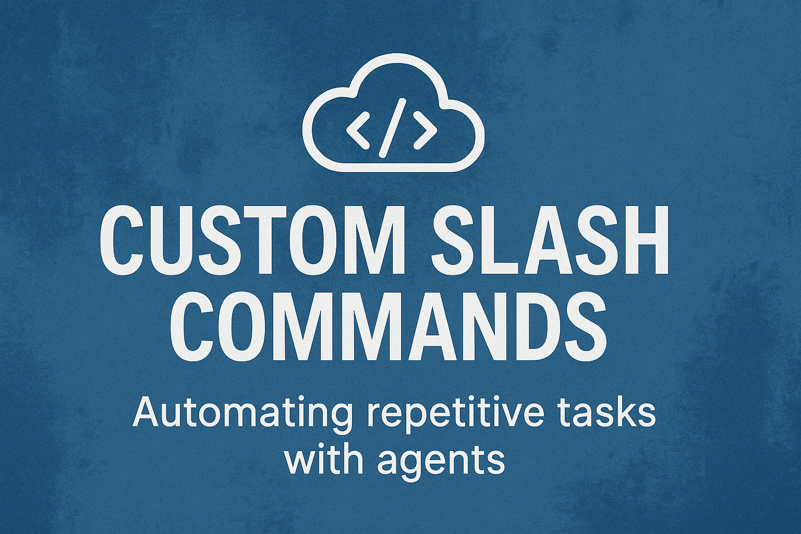

A few weeks ago, I showed you [custom slash commands](https://www.stefanmunz.com/posts/2025/custom-slash-commands-a-field-trip-with-claude-code/custom-slash-commands-a-field-trip-with-claude-code) for storing prompts you need repeatedly. But I ran into a problem: sometimes Claude followed my instructions perfectly, sometimes not. I found the fix.

My first attempts were useful, but inconsistent. Sometimes the agent followed the orders exactly, sometimes it improvised. Still, it improved the structure and findability of these saved prompts, as before my codebases were cluttered with small READMEs.

### The Breakthrough: Scripts + Prompts = 100% Repeatability

Custom slash commands aren't just for storing prompts in a markdown file. You can also put scripts in the same folder and instruct the coding agent to use that script. This was my breakthrough on repeatability.

Consider [this cleanup script](https://gist.github.com/stefanmunz/0a076d567c591deec34723866198c755). Here's what happens when I run it:

- The prompt explains what the script will do and asks for my confirmation.
- I type yes
- Claude executes the script and monitors its output, warning me about unexpected behavior.

This saves a lot of time, every day. It's the best UI to run scripts I need regularly. I can verify I selected the right script before execution because I often selected the wrong one in a hurry. And I get automatic monitoring that catches problems.

### The Bigger Vision: Slash Commands as Installers

Here's how I'll handle the installer routine for TreeOS. Instead of asking people to read a README and follow five to seven steps, they'll run a custom slash command. I'd love to see this pattern in many tools.

Example: A few days ago I found [Mergiraf](https://codeberg.org/mergiraf/mergiraf), a clever tool that makes git conflicts less scary. Hosted on [Codeberg](https://codeberg.org) 🇪🇺! The installation guide is concise, but you need to map it to your platform. And then you still need to [configure it as a git merge driver](https://mergiraf.org/usage.html#registration-as-a-git-merge-driver).

How cool would it be if they shipped a custom slash command that detects your system, recommends the best installation method, and walks you through configuration? And they could also include a script to remove the tool, if it doesn't work for me. This would dramatically reduce the cognitive overhead of trying a new tool like Mergiraf.

With the explosion of tools we're seeing right now, lengthy setup routines are a real barrier. Slash commands with embedded scripts could change that.

<!--LINKS_SEPARATOR-->

### 90% Agents vs 100% Agents

- **URL:** https://lucumr.pocoo.org/2025/9/29/90-percent/
- **MyTake:** What an insightful piece. I think Armin took a valid approach; I'm more and more seeing the negative effects of delegating 100% of code to the agents.
- **Keyword:** link

---

### Claude Code System Prompt Evolution

- **URL:** https://x.com/repligate/status/1972811795472470484
- **MyTake:** Interesting to see how the system prompt changed in Claude Code, but only for Sonnet 4.5. Apparently, they are able to fine-tune the models much more to their needs. Let's see if other vendors follow. Ultimately, this could mean that models and coding agent software become much more interchangeable, where right now they live in kind of a symbiosis.
- **Keyword:** link

---

### Devin Sonnet 4.5: Lessons and Challenges

- **URL:** https://cognition.ai/blog/devin-sonnet-4-5-lessons-and-challenges
- **MyTake:** This has the brutal undertone you would expect of a 996 company. It leaves me with the impression they're working against and not with the model.
- **Keyword:** link

---

### Avoiding AI Coding Mistakes

- **URL:** https://newsletter.posthog.com/p/avoid-these-ai-coding-mistakes
- **MyTake:** Great advice from the PostHog team on avoiding AI coding mistakes. We'll need to structure code bases very differently use coding agents effectively. Also, scripting languages like Python are much harder to improve with agents. Happy I can build a code base from scratch instead of discovering agentic needs with a huge code base.
- **Keyword:** link

---

### Why I Gave the World Wide Web Away for Free

- **URL:** https://www.theguardian.com/technology/2025/sep/28/why-i-gave-the-world-wide-web-away-for-free
- **MyTake:** Beautiful article on the web's origins and the founder's vision. I totally agree we can restore the web to its intended state compared to this monopolistic shithole we are in right now.
- **Keyword:** link

<!--PRINT_SEPARATOR-->

## What to Print This Week

### Mini LED Studio Spotlight Lamp / Softbox

It's getting darker outside. Time to set up your video equipment for these early morning or evening video calls.

[visit model page](https://makerworld.com/en/models/1514457-mini-led-studio-spotlight-lamp-softbox#profileId-1586589)

<!--FOOTER_SEPARATOR-->

## Hi 👋, I'm Stefan!

This is my weekly newsletter about technology becoming more fluid and adaptive - from rigid software to liquid tools that shape themselves to our needs. Feel free to forward this mail to people who should read it. If this mail was forwarded to you, please subscribe here, it's always 1 mail per week. https://liquid.engineer.

Stefan Munz, www.stefanmunz.com
