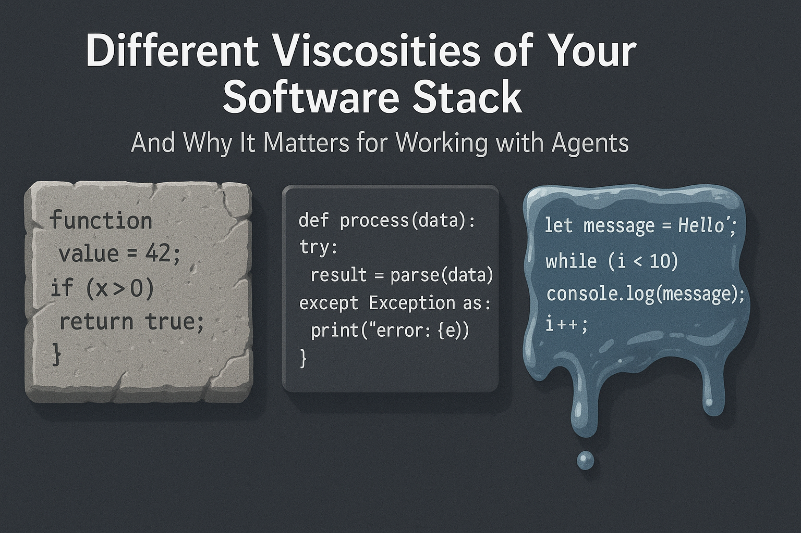

I love how new terms are being coined at the moment. Simon Willison's post about getting [from Vibe coding to Vibe engineering](https://simonwillison.net/2025/Oct/7/vibe-engineering/?utm_source=substack&utm_medium=email) is a perfect example. Unfortunately, it's missing one key property of codebases: The differing viscosities of your files and often lines.

The blog post is a superb summary of things to look out for efficiently coding with agents. I found myself nodding at every bullet point. As an engineering leader who pitched a lot of these for implementation, it often feels like we can ultimately prove now that good software engineering practices have a business impact, instead of being misunderstood as a goodie for the engineers...

One aspect was lacking, and in the spirit of coining terms, I'd like to name it viscosity of software. Every codebase has fast, easy-to-change parts and almost impossible-to-change parts. If you draft to change them, you'll spend the whole week convincing other engineers. These crucial files or lines have many implications to the whole project. It's often unclear which lines are written in stone and which are written in sand.

Another way to frame this is tribal knowledge: Engineers accustomed to this codebase know these corners from their own experience or because of the stories around it. So far, I didn't find a way to onboard my agents with this knowledge. Every agent comes in like a new developer, not knowing anything about the code. It's amazing how fast they navigate the codebase. The AGENTS.md and code comments help a bit, but it's a main frustration point when relying more on agents. They're unaware of this tribal knowledge and I don't know how to teach them.

How do we teach a machine to be afraid of the right lines of code? I'd love to hear your thoughts.

<!--LINKS_SEPARATOR-->

### AT Protocol Self-Hosting Guide

- **URL:** https://atproto.com/guides/self-hosting
- **MyTake:** Dug into the self-hosting part of the AT protocol. It's on my list of things to set up, even just to understand it better.
- **Keyword:** link

---

### ATWork Place - Own Your Data Job Board

- **URL:** https://atwork.place/
- **MyTake:** A job board where you own the data is a fascinating idea. I hope this takes off.
- **Keyword:** link

---

### Stacked Diffs and Agentic Coding

- **URL:** https://www.youtube.com/watch?v=qBRJxIw7gBg
- **MyTake:** Stacked diffs have existed for a while but never became popular. With agentic coding, they make more sense, because it's easy to change many things in one session, which becomes hard to review.
- **Keyword:** link

---

### Apple's Finance-Led Leadership

- **URL:** https://www.youtube.com/watch?v=JUG1PlqAUJk&t=1290s
- **MyTake:** Apple is led by finance people. Good if you're a short to mid-term investor (as the finance execs mostly are), bad for users of the products. Time to start looking for alternatives.
- **Keyword:** link

<!--PRINT_SEPARATOR-->

## What to Print This Week

### Halloween Minion Bob

Who doesn't love minions?

[visit model page](https://makerworld.com/en/models/1843188-halloween-minion-bob-sweet-but-scary#profileId-1969429)

### Knife magnet with blood

Moar magnets!

[visit model page](https://makerworld.com/en/models/1852757-knife-magnet-with-blood#profileId-1980766)

### Mini Pizza Oven Tea Light

Autumn time is pizza time.

[visit model page](https://makerworld.com/en/models/914664-mini-pizza-oven-tea-light#profileId-875993)

<!--FOOTER_SEPARATOR-->

## Hi 👋, I'm Stefan!

This is my weekly newsletter about technology becoming more fluid and adaptive - from rigid software to liquid tools that shape themselves to our needs. Feel free to forward this mail to people who should read it. If this mail was forwarded to you, please subscribe here, it's always 1 mail per week. https://liquid.engineer.

Stefan Munz, www.stefanmunz.com