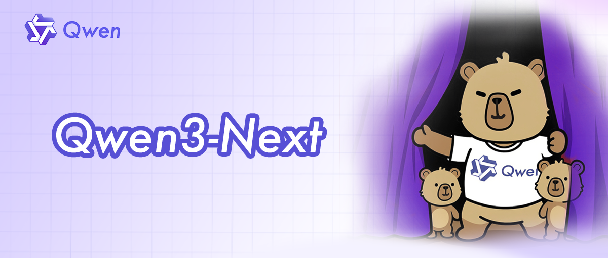

Just last month, Alibaba's Qwen team released something remarkable that has gone mostly unnoticed: [Qwen3-Next-80B](https://huggingface.co/Qwen/Qwen3-Next-80B-A3B-Instruct), an [80 billion parameter model that runs as fast as a 3 billion parameter](https://qwen.ai/blog?id=4074cca80393150c248e508aa62983f9cb7d27cd&from=research.latest-advancements-list) one.

This isn't just another upgrade. It's a paradigm shift and glimpse into the future of local AI. It's also a perfect showcase of the current local inferencing ecosystem.

## The Model That Changes the Game

The magic is in its ultra-sparse Mixture of Experts (MoE) architecture. Think of it like a massive library with 80 billion books (total parameters), but your librarian only pulls the 3 billion most relevant ones for your query (active parameters). You get the knowledge of the entire library at the speed of a small, curated collection. Interestingly, this is also similar to how actual brains work, where the prefrontal cortex directs attention to the correct brain region.

This architecture results in knowledgeable models with fast inference. [According to real-world benchmarks](https://medium.com/@ai-engineering-trend/lm-studio-supports-qwen3-next-model-a-new-option-for-mac-users-9116f5e730be), on a high-end Mac Studio M3 Ultra with 8-bit quantization, this translates to 50 tokens per second—fast enough for a real-time conversation with a world-class AI.

Sounds too good to be true? Unfortunately, there are a few catches, at least for now. Qwen3-Next uses a [novel hybrid attention architecture](https://www.alizila.com/qwen3-next-a-new-generation-of-ultra-efficient-model-architecture-unveiled/) combining Gated DeltaNet and Gated Attention—tricky new architectural features that most existing tools weren't built for. The struggle to run it on affordable hardware reveals everything about the three main paths for local AI in 2025.

---

## Path 1: The Apple Fast Lane

Qwen3-Next released on September 11. Full support in the popular LM Studio app? [September 16.](https://x.com/lmstudio/status/1967985102845366280) Just five days later. On a Mac, it just works. You download the model from [LM Studio's catalog](https://lmstudio.ai/models/qwen/qwen3-next-80b), and it runs. Why is that?: Apple controls the entire stack. Their [MLX framework](https://github.com/ml-explore/mlx) is a specialized engine built to get the most out of their own silicon. When a new model like Qwen3-Next appears, developers can write support for it directly in MLX, bypassing the community bottlenecks that affect other platforms.

While Apple is sleepy on their product side at integrating AI, the MLX is on top of the game.

The performance is great, on [this blog post](https://medium.com/@ai-engineering-trend/lm-studio-supports-qwen3-next-model-a-new-option-for-mac-users-9116f5e730be) there are claims for 14 tokens/sec on a Mac Mini M4 Pro with 64GB and a whopping 50 tokens/sec on a Mac Studio M3 Ultra. But this seamless experience comes at a premium. A Mac Studio equipped to run this model comfortably (128GB unified memory) starts around $7,200. You're paying for a vertically integrated ecosystem where the hardware and software are perfectly in sync.

## Path 2: The Professional Choice with NVIDIA

Support for Qwen3-Next? Day one. If you have the right hardware, running the model is as simple as a single command line or a few lines of Python. The professional AI world is built on NVIDIA and its mature software ecosystem. Frameworks like [vLLM](https://docs.vllm.ai/), [Transformers](https://huggingface.co/docs/transformers/main/en/model_doc/qwen3_next), and [SGLang](https://github.com/sgl-project/sglang) are designed for production servers and work directly with a model's native PyTorch code. There's no need for conversion or waiting for updates. If the model's creators release it, these tools can run it instantly.

The full, unquantized 80B model is massive and impractical for most users. Instead, the standard approach is quantization — compressing the model to use less memory with minimal quality loss.

[According to deployment guides](https://developers.redhat.com/articles/2025/09/12/run-qwen3-next-vllm-red-hat-ai-step-step-guide), common quantization formats include:

- FP8: ~40GB of VRAM needed

- INT8: ~42GB of VRAM needed

- INT4/AWQ: ~22GB of VRAM needed

Even with aggressive quantization, you're looking at 22-40GB+ of VRAM. A single NVIDIA A100 80GB costs $10,000-15,000, so out of range for most. Consumer cards like the RTX 4090 (24GB) can't fit even the most aggressive quantizations of an 80B model.

The Trade-Off: NVIDIA offers the most mature, powerful, and instantly-compatible software. But for the newest, largest models, it's realistically a cloud or enterprise solution, not a local one for most consumers. Unless you have access to datacenter GPUs, you're limited to smaller models or cloud inference. The just released [Spark DGX](https://www.youtube.com/watch?v=Lqd2EuJwOuw) could change that, but general availability is unclear.

---

## Path 3: The Open Path with AMD

This is my path, and it's the one most people are on.

The hardware is ready. My AMD Ryzen AI Max+ 395 is a beast, offering 128GB of unified LPDDR5X-7500 memory. For inference, fast memory is the limiting factor. Strix Halo matches Apple's M4 Pro line and the DGX Spark, if it will ever be available. It's a much more affordable system, e.g. with the [Framework Desktop](https://frame.work/desktop).

But it can't run next generation models like Qwen3-Next-80B, at least for now. [Llama.cpp](https://github.com/ggml-org/llama.cpp) is a brilliant open source community project. It's the workhorse of local AI on AMD, making models accessible to everyone.

However, its universality is also its bottleneck. To support a radically new model like Qwen3-Next, a volunteer developer has to painstakingly implement the new architecture inside llama.cpp. As of October 2025, [the pull request for Qwen3-Next](https://github.com/ggml-org/llama.cpp/pull/16095) is still a work in progress, with developers debugging complex issues like partial RoPE implementation. Whatever that is. Llama.cpp also powers the popular [Ollama](https://github.com/ollama/ollama/issues/12349), so it has the same problems right now. The hardware is more than capable, but we're all waiting for the community software to catch up.

Are there alternatives? Yes, there are actually two right now.

AMD users can use vLLM like NVIDIA users do. But despite [ROCm 6.4.1 and 7.0](https://rocm.blogs.amd.com/) supporting the Ryzen AI Max+ 395 chipset (gfx1151), [vLLM compatibility remains problematic](https://github.com/ROCm/ROCm/issues/4909). Users encounter "invalid device function" errors during model initialization, and official support for gfx1151 is still an open feature request.

With [SGLang](https://github.com/sgl-project/sglang) it's the same story. It's a framework that comes from the bigger cloud center hardware and is slow at adopting consumer hardware like the AMD AI Max+. There's a [PR open](https://github.com/sgl-project/sglang/issues/11195), but little activity.

## What This All Means

This one model neatly illustrates the trade-offs in local AI today:

1. Apple & NVIDIA: The "it just works" experience. It's fast and polished, but you pay a premium for admission to the walled garden. You might go faster now, but beware of locking yourself in.

2. AMD & Llama.cpp: The universal path. It brings AI to the most hardware at the best value, but for brand-new, architecturally complex models, there can be a delay as the open-source ecosystem catches up.

The good news is that the community path is rapidly improving:

In LLama.cpp there's [a lot of activity](https://github.com/ggml-org/llama.cpp/pull/16095). I find it hard to follow all the details, even as a hardware enthusiast. Ollama's [new inference engine with direct GGML access](https://ollama.com/blog/multimodal-models) shows they're building toward faster support for novel architectures, though the transition is ongoing.

Ultra-efficient MoE models like Qwen3-Next prove that frontier-level intelligence can run on our local machines. The infrastructure is racing to keep up, and this competition means a better future for everyone, no matter which path you're on.

<!--LINKS_SEPARATOR-->

- **URL:** https://pxlnv.com/linklog/us-state-department-dsa/
- **MyTake:** U.S. State Department Wants to Use Tech Companies as Leverage Over European Policy. Let's see how far they'll take this, but it wouldn't be surprising anymore if they escalate this soon.
- **Keyword:** link

---

###

- **URL:** https://blog.langchain.com/deep-agents/
- **MyTake:** From Shallow Loops to Deep Agents. Great explanation of how shallow agents worked so far and why deep agents like Claude Code kick differently. I'm against calling it deep agents already after not even a year of evolution. What's next? Ultra-deep agents?
- **Keyword:** link

---

###

- **URL:** https://www.philschmid.de/agents-2.0-deep-agents
- **MyTake:** Agents 2.0: From Shallow Loops to Deep Agents. Awesome post about shallow and deep agents from Phil Schmid. I like Agent 2.0 more than deep agents, it allows for further room to grow.
- **Keyword:** link

---

### 3D Printed Portable Bluetooth Speaker

- **URL:** https://www.youtube.com/watch?v=McppzJ06tCs
- **MyTake:** Cool video about 3D printing your own portable Bluetooth speaker using high-quality components. Hope this business model works and he can continue this channel!
- **Keyword:** link

<!--PRINT_SEPARATOR-->

## What to Print This Week

### Dieter Portable Bluetooth Speaker

Unfortunately sold out at the moment. Such a well-designed speaker and so much to learn about how these things work!

[visit model page](https://printyourspeakers.com/products/dieter-portable-bluetooth-speaker)

<!--FOOTER_SEPARATOR-->

## Hi 👋, I'm Stefan!

This is my weekly newsletter about technology becoming more fluid and adaptive - from rigid software to liquid tools that shape themselves to our needs. Feel free to forward this mail to people who should read it. If this mail was forwarded to you, please subscribe here, it's always 1 mail per week. https://liquid.engineer.

Stefan Munz, www.stefanmunz.com
