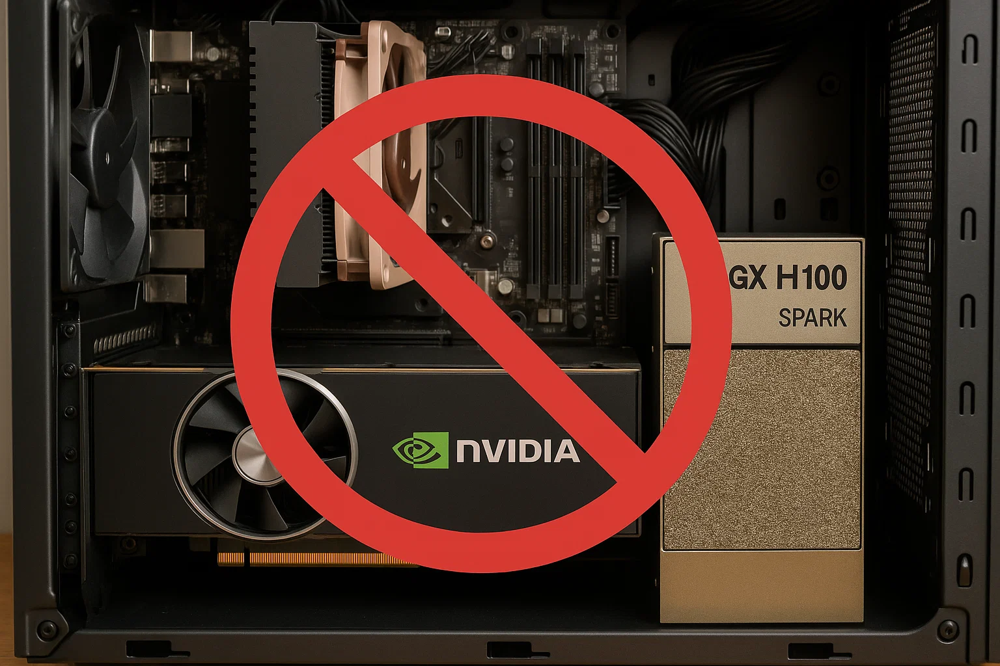

When you're shopping for hardware to run LLMs locally, the conversation typically starts with NVIDIA GPUs. They have the best driver support, the most mature ecosystem, and work with everything. But here's the problem: **consumer NVIDIA cards are hitting a hard ceiling that makes them unsuitable for modern local LLM inference.**

This is the first in a three-part series on hardware options in 2025. We'll cover why NVIDIA consumer cards fall short, why Apple's ecosystem pricing is prohibitive, and ultimately, what you should actually buy.

## The 32GB Wall and custom builds

Let's start with the most established path: **NVIDIA GPUs**.

NVIDIA has the best driver support, the most mature ecosystem, and the widest software compatibility. If you're running vLLM, Transformers, or any PyTorch-based inference stack, NVIDIA just works.

The problem? Most consumer and prosumer NVIDIA cards top out at **32GB of VRAM**. On top, there's a reason why NVIDIA's stock price is soaring. They demand a huge premium for their products:

- RTX 5090: 32GB, 2500+ Euro
- RTX 3090: 24GB, 1300+ Euro
- (Professional cards like the RTX 6000 Pro Blackwell: 96GB, 8,000+ Euro)

With one of these in the shoppingcart you just have the graphics card, leaving out the remaining components like CPU, RAM, SSDs, power supply and a case to house it all. There is no standard around building this, everything is possible. While this may sound cool, this is a maintenance nightmare. Do I see this special behavior on this machine because I have an Intel CPU and an ASUS motherboard? You can never rule this out, and usually you don't have a second system to do a comparison with easily. Stability requires uniformity, there's no way around it.

## Quantization Explained

Before we talk about memory constraints, let's understand how model size changes with quantization.

Modern LLMs store parameters as numbers. Quantization reduces the precision of these numbers to save memory. Here's what that looks like for two common model sizes:

**32B Model (like Qwen3 32B):**

- **FP16 (16-bit)**: ~64GB
- **8-bit quantization**: ~32GB
- **4-bit quantization**: ~16-18GB
- **3-bit quantization**: ~12-14GB

**70B Model (like Llama 3.1 70B):**

- **FP16 (16-bit)**: ~140GB
- **8-bit quantization**: ~70GB
- **4-bit quantization**: ~35-38GB
- **3-bit quantization**: ~26-28GB

The rule of thumb: **divide the parameter count by the bits per parameter** to get approximate memory usage. A 32B model at 4-bit quantization needs roughly 32B ÷ 2 = 16GB, plus some overhead for model structure.

Lower quantization (3-bit, 4-bit) saves memory but reduces model accuracy slightly. For most local inference use cases, 4-bit quantization offers the best balance: you keep ~95% of model quality while cutting memory usage to ~25% of the original.

But here's the catch: **the model weights are only part of the story.**

### Why 32GB Isn't Enough Anymore

Here's the thing people miss: GPU memory doesn't just hold the model weights. It also holds **the KV cache**: This stores the attention keys and values for your entire context window. Avid agentic coders know this as their context, and it's always running out too fast!

Let's do the math on a practical example:

**Qwen3 32B (4-bit quantization):**

- Model weights: ~18GB
- You have 14GB left for context on a 32GB card
- The KV cache size per token depends on the model's architecture. A typical 32B model consumes around **0.5 to 1.0 MB of VRAM per token** in the context window
- With 14GB remaining: `14,000 MB / 0.5 MB per token` = **~28,000 tokens of context** (or as low as ~14,000 tokens with FP16 KV cache)

That sounds like a lot—until you understand what actually consumes those tokens in real-world usage.

### What Eats Your Context Window

Here's what fills up those 28,000 tokens in practice:

**System prompts and instructions**: 500-2,000 tokens

- Base system prompt defining the agent's behavior
- Task-specific instructions
- Safety guidelines and constraints

**MCP (Model Context Protocol) plugins and tools**: 2,000-5,000+ tokens

- Tool definitions for each MCP server
- Function schemas and examples
- Return value specifications
- Multiple plugins stack up quickly

**Conversation history**: Variable, but grows fast

- Your messages to the agent
- Agent's responses
- Multi-turn back-and-forth
- A 20-message conversation can easily hit 10,000+ tokens

**Retrieved context**: 10,000-50,000+ tokens

- Document chunks pulled from vector databases
- Code files for context
- API documentation
- Knowledge base articles

**Working memory for long-running tasks**: The killer use case

- Agent exploring a codebase
- Multi-step research tasks
- Complex debugging sessions
- Building features across multiple files

This last point is crucial: **long context = agents can work independently for longer before needing a reset**. If your context fills up after 20,000 tokens, your agent might need to restart after 10-15 tool calls. With significantly more tokens available (100K+ on systems with more memory), the agent can run through dozens of tool calls, maintain full context of what it's tried, and make better decisions.

And if you want to run a larger model—say, a 70B quantized to 4-bit (~38GB)—you can't even fit it on a 32GB card, let alone leave room for meaningful context.

**The verdict**: NVIDIA GPUs are excellent for established models and production workloads where you control the infrastructure. But consumer cards hit a hard ceiling when you want both large models AND extensive context.

## What About NVIDIA's DXG Spark?

NVIDIA's Grace Blackwell DGX Spark has an interesting spec:

- 128GB unified LPDDR5x memory
- 20 core ARM processor
- 1 petaflop AI performance
- 10 GbE, ConnectX-7 Smart NIC
- pricepoint between 3000 and 4000 Euro.
- new NVFP4 format

On paper, this is a game-changer for local LLM inference. The most interesting thing is the new NVFP4 format, allowing for more aggressive quantization. Research has shown that models can be trained to fit into this quantization with almost the same performance. As this is a hardware supported feature, it can't be copied quickly from Apple or AMD.

But the machine is far from available: It was announced for a long time, now we have seen the first videos, but also only sold out shops so far.

Even if it becomes available, this is a subsidized offer from NVIDIA. They are expecting very high margins for their products. By the nature of the price, this cannot maintain typical nvidia margins. They want you to buy into this ecosystem and then once it works locally go the most convenient way of running it on NVIDIA hardware in the data center as well. This machine is a mechanism to lock you into their ecosystem.

Most of the things Nvidia does are closed source: CUDA is closed source, the operating system running the DGX Spark DGX OS 7 is closed source, the list goes on. We've seen the play before, and we're not eager to run into the trap again.

## The Memory Wall Is Real

Here's what's become clear: **local LLM inference is increasingly memory-bound, not compute-bound**.

Modern MoE architectures like Qwen3-Next demonstrate this perfectly:

- 80B total parameters, only 3B active per token
- Inference speed is excellent—if you have the memory to hold it
- Context window length matters as much as model size

The bottleneck isn't "can my GPU compute fast enough?" It's "can I fit the model AND enough context to do meaningful work?"

This is why 32GB cards are increasingly limiting. They work for smaller models or shorter contexts, but can't handle the frontier of what's possible with local inference.

This post is part of a three part series. Next week: Why you shouldn't buy into the Apple ecosystem.

<!--LINKS_SEPARATOR-->

### Green Tea GC: A Garbage Collector Deep Dive

- **URL:** https://go.dev/blog/greenteagc
- **MyTake:** Interesting deep dive into garbage collectors. I generally love the tone of the go blog, explaining something that is so complex and low level in such simple words.
- **Keyword:** link

---

### Building Simple Webtools with Agents

- **URL:** https://www.youtube.com/watch?v=GQvMLLrFPVI
- **MyTake:** Interesting walkthrough on how to build simple webtools with agents. I am not sure where this will take us, but we will see much more of these custom little helpers.
- **Keyword:** link

---

### Just Talk To It

- **URL:** https://steipete.me/posts/just-talk-to-it
- **MyTake:** Long read from Peter Steinberger but worth it. I share the observation that MCPs are a dead horse and the CLI rules.
- **Keyword:** link

<!--PRINT_SEPARATOR-->

## What to Print This Week

### Ultra Mini Escalator

Cute miniature model for 0.2 mm nozzles with a great design.

[visit model page](https://makerworld.com/en/models/1930854-ultra-mini-escalator-designed-for-0-2-mm-nozzles#profileId-2072743)

<!--FOOTER_SEPARATOR-->

## Hi 👋, I'm Stefan!

This is my weekly newsletter about technology becoming more fluid and adaptive - from rigid software to liquid tools that shape themselves to our needs. Feel free to forward this mail to people who should read it. If this mail was forwarded to you, please subscribe here, it's always 1 mail per week. https://liquid.engineer.

Stefan Munz, www.stefanmunz.com
