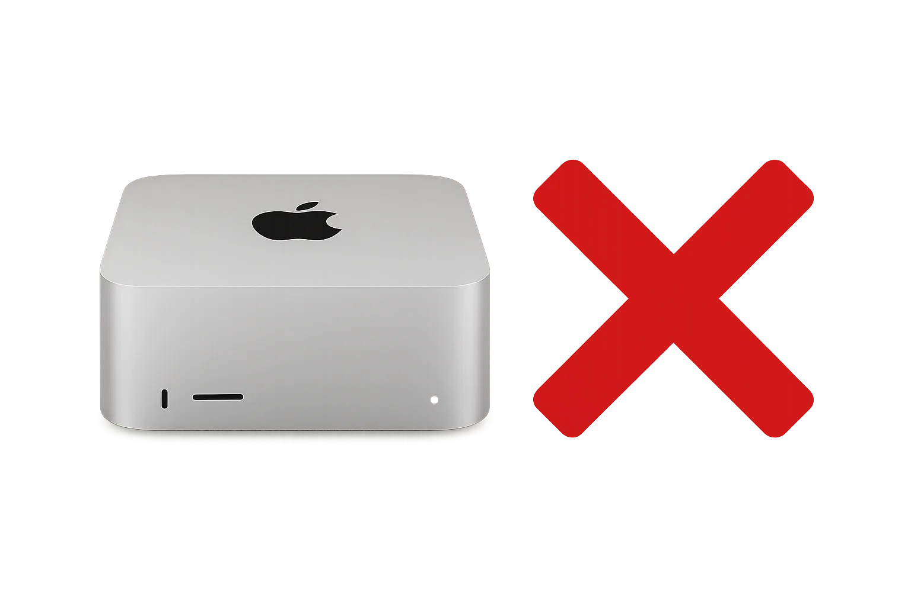

Apple Silicon Macs are engineering marvels. The unified memory architecture works beautifully for AI workloads, MLX provides excellent framework support, and the hardware delivers impressive performance. As we saw in [our deep dive on running Qwen3-Next-80B](https://ontree.co/blog/2025/running-qwen3next80b-locally-october-2025-case-study/), Macs can run large models with excellent inference speed.

But here's the hard truth: **Apple's RAM pricing model makes their hardware prohibitively expensive for local LLM inference.**

This is the second in a three-part hardware series. [Part one covered why NVIDIA consumer cards fall short](https://ontree.co/blog/2025/why-you-shouldnt-buy-an-nvidia-gpu-or-the-dgx-spark-for-local-llm-inference-in-2025/). Now let's talk about why Apple's pricing ruins what would otherwise be a very good solution.

## What Apple Gets Right

Let's start with what makes Apple Silicon genuinely impressive for LLM inference:

### Unified Memory Architecture

This is where Apple's engineering truly shines. Unlike traditional systems where CPU and GPU have separate memory pools requiring constant data copying, Apple Silicon uses one unified memory pool accessible to everything.

Here's why this matters for LLM inference:

**No data copying overhead**: When you load a model, it sits in memory once. The GPU doesn't need to copy data from CPU RAM. The Neural Engine can access it directly. There's no PCIe bottleneck, no memory duplication, just direct access.

**Memory bandwidth**: This is where Apple Silicon separates itself from the competition. The memory controllers are integrated directly into the SoC, enabling extremely high bandwidth:

**M4 Pro (Mac Mini M4 Pro)**:

- **Up to 273 GB/s memory bandwidth**
- 64GB max configuration
- 2 TB SSD to hold some llm models
- no option for a second SSD
- Price: 3200 Euro
- Excellent value for most LLM use cases

**M4 Max**:

- **Up to 546 GB/s memory bandwidth**
- 128GB max configuration
- 2 TB SSD
- Price: 4800 Euro
- Highest bandwidth in the consumer space

**Why bandwidth matters**: LLM inference is memory-bound. You're constantly reading model weights and KV cache from memory. With 546 GB/s on the M4 Max, you can feed the GPU fast enough to maintain high token generation speeds even with massive models. This is 2-3x the bandwidth of typical DDR5 systems and far exceeds what you get with discrete GPUs (which are limited by PCIe bandwidth for system RAM access).

For comparison, a typical high-end DDR5 system might deliver 100-150 GB/s. AMD's Ryzen AI Max+ 395, delivers M4 Pro levels around 250 GB/s. Apple's M4 Max at 546 GB/s is in a league of its own.

This bandwidth advantage is why Macs can achieve 50+ tokens/sec on 70B-80B models despite having less raw compute than some alternatives. You're not waiting on memory access—the bottleneck is genuinely compute, not memory bandwidth.

For LLM inference, this unified memory architecture with massive bandwidth is exactly what you want. It's genuinely impressive engineering.

### Excellent Driver Support

The MLX framework provides day-one support for novel model architectures. When Qwen3-Next-80B dropped with its new architecture, MLX had it running immediately. No waiting for driver updates, no compatibility hacks.

## The Problems: Pricing and macOS

Here's where it all falls apart: **Apple's RAM pricing is absurd**. It's like this for a long time. As Apple is a highly profitable company, I see zero chance of this changing in the near future. Actually, this is an understandable strategy to keep their high margins.

Even if you consider paying the premium to run on Apple Hardware, I am not recommending to run them as servers. Apples macOS is an operating system built for personal computers. While they advanced headless usage, it's still an afterthought for Apple. Running a secure node is just not that easy and forces you to work against the OS. Running Linux is somehow possible, but also an edgecase for these distributions. The last thing you want in a quickly developing hardware ecosystem is to be a edgecase, as this usually leads to driver and other obscure problems.

## The Takeaway

Apple Silicon is legitimately impressive hardware. The engineering is excellent, the performance is strong, and the software ecosystem is mature.

But **Apple's RAM pricing and macOS ruin what would otherwise be the perfect solution** for local LLM inference.

For price-conscious builders who want maximum memory for local LLM inference, Apple simply doesn't make financial sense.

**Previously**: [Why you shouldn't buy an NVIDIA GPU](https://ontree.co/blog/2025/why-you-shouldnt-buy-an-nvidia-gpu-or-the-dgx-spark-for-local-llm-inference-in-2025/) - the 32GB limitation problem.

**Next**: Why you should buy an AMD machine - the actual solution that gives you fast 128GB of RAM for half the price.

<!--LINKS_SEPARATOR-->

### Building a private equity company with VC money

- **URL:** https://www.forbes.com/sites/iainmartin/2025/10/30/bending-spoons-cofounders-become-billionaire-after-italian-startup-raises-at-11-billion-valuation/
- **MyTake:** What a strategy: Building a private equity company, applying their playbook and using VC money to finance it. The finance and startup world continues to amaze me, but in a negative way. As a customer of meetup.com, a company Bending Spoons acquired, I'm not confident this is a good playbook.
- **Keyword:** link

---

### Chicago Fed on IT sector productivity concentration

- **URL:** https://www.chicagofed.org/publications/chicago-fed-letter/2025/515
- **MyTake:** The Chicago Federal Reserve Bank on why the main productivity gains in the US economy are due to the IT sector and why this concentration bears risks if it continues like this. Seems to be rather unprecedented what we're experiencing right now economically.
- **Keyword:** link

---

### Phoenix: Open Source LLM tracing platform

- **URL:** https://phoenix.arize.com/
- **MyTake:** Open Source and self-hostable LLM tracing and evaluation platform, built on the OpenTelemetry standard.
- **Keyword:** link

<!--PRINT_SEPARATOR-->

## What to Print This Week

### Hand-Operated Siren

Not planning to print this, actually. Would love to have such a thing attached to my bike, so that I can honk back whenever crazy cars honk at me for no good reason...

[visit model page](https://makerworld.com/en/models/1919577-shou-yao-bao-jing-qi-hand-operated-siren#profileId-2059663)

<!--FOOTER_SEPARATOR-->

## Hi 👋, I'm Stefan!

This is my weekly newsletter about technology becoming more fluid and adaptive - from rigid software to liquid tools that shape themselves to our needs. Feel free to forward this mail to people who should read it. If this mail was forwarded to you, please subscribe here, it's always 1 mail per week. https://liquid.engineer.

Stefan Munz, www.stefanmunz.com
