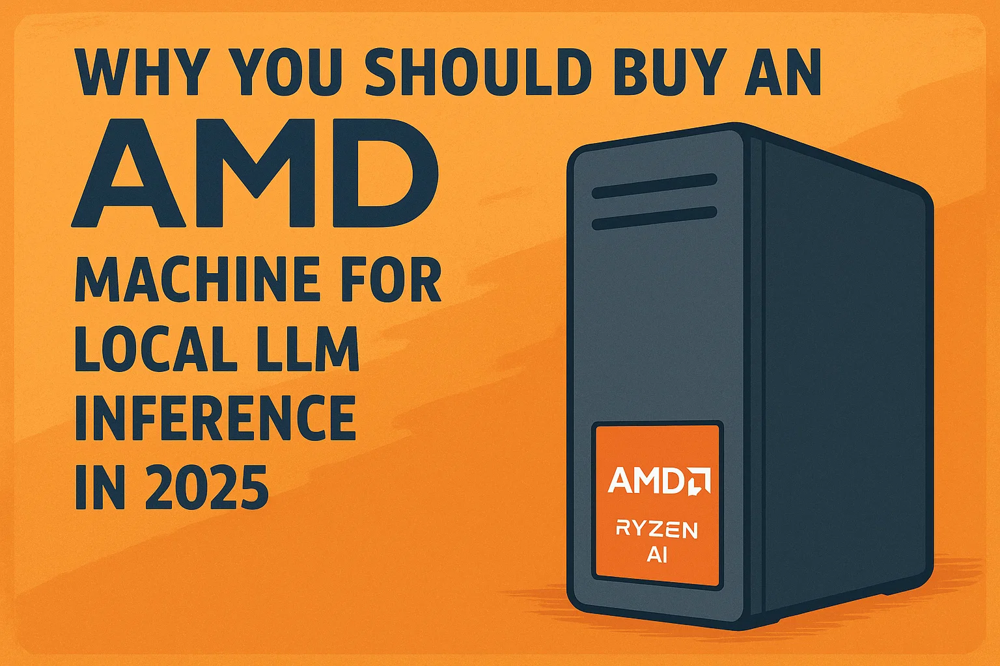

We've covered why [NVIDIA consumer cards hit a 32GB wall](https://www.stefanmunz.com/posts/2025/why-you-shouldnt-buy-an-nvidia-gpu-or-the-dgx-spark-for-local-llm-inference-in-2025/why-you-shouldnt-buy-an-nvidia-gpu-or-the-dgx-spark-for-local-llm-inference-in-2025/) and why [Apple's RAM pricing is prohibitive](https://www.stefanmunz.com/posts/2025/why-you-shouldnt-buy-into-the-apple-ecosystem-for-local-llm-inference/why-you-shouldnt-buy-into-the-apple-ecosystem-for-local-llm-inference/). Now let's talk about the actual solution: **AMD Ryzen AI Max+ 395 with 128GB unified memory**.

This is the hardware I chose for my home LLM inference server. Here's why.

## It's Open, Baby!

In contrast to the two big competitors NVIDIA and Apple, AMD has a huge amount of their stack open source. What CUDA is for NVIDIA and MLX for Apple, that's ROCm for AMD. It's fully open source, available on GitHub, and sees a huge amount of activity. This not only gives me a warm and fuzzy feeling, but also a lot of confidence that this stack will continue to go in the right direction.

## The Hardware That Changes the Game

**AMD Ryzen AI Max+ 395** offers something unique in the prosumer market:

- **128GB of fast unified memory** (96GB available to GPU)
- Integrated GPU with discrete-class performance
- Complete system cost: **2000-2500 Euro**
- Less than half the cost of the equivalent Mac Studio!

To make this more concrete: you can run a 70B model quantized to 4-bit (~38GB) and still have **50GB+ for context**. That's enough for 250K+ token contexts, legitimately long-document processing, extensive conversation history, and complex RAG workflows.

Looking a bit into the future, it's not hard to imagine AMD shipping the system with 256 gigabytes of RAM for a reasonable price. It's very hard to imagine Apple shipping a 256 gigabytes machine for a reasonable price. It's just how they make their money.

## Comparison to the DGX Spark

The recently released DGX Spark is a valid competitor to AMD's AI Max series. It also features 128GB of super unified memory. From a pure hardware value perspective, the [NVIDIA DGX Spark](https://www.nvidia.com/en-us/products/workstations/dgx-spark/) is the most compelling alternative on the market in October 2025. Street price is around [4500 Euro](https://www.idealo.de/preisvergleich/OffersOfProduct/208146353_-dgx-spark-founders-edition-940-54242-0005-000-nvidia.html) right now, almost double. You get a beautiful box with very comparable hardware and better driver support. You even get a good starting point to do your first experiments, like downloading LLMs and training your model. But everything you build on is closed source. You're 100% dependent on NVIDIA staying on top of the game, on a machine that doesn't make a lot of money for NVIDIA. I'm not that optimistic.

With the recent explosion of speed and everything in software with the help of coding agents, I'm not confident any company can stay on top of all of that. Especially not a company that earns their biggest profits in this sector.

Also the NVIDIA DGX Spark is Arm-based, which isn't a problem for inference and training, but for another use case which is becoming important.

## Running Apps and LLMs Side by Side

If you are doing LLM inference on a local machine, the easiest setup is to also run the apps needing the inference on the same machine. Running two machines is possible but opens a huge can of worms of problems. Even though it might not make sense intuitively, such distributed systems are complex. Not double complex, more like exponentially complex. Here's a [golden question from 10 years ago](https://stackoverflow.com/questions/29845191/why-are-distributed-systems-considered-complex) on Stackoverflow, trying to explain it.

So running everything on one machine is much simpler. With AMD you're staying on the most common CPU architecture available [x86-64](https://en.wikipedia.org/wiki/X86-64). With the DGX Spark, you're in [Arm land](https://en.wikipedia.org/wiki/ARM_architecture_family). This architecture is gaining traction, but still a far way from being universally supported. If you're planning to experiment with a lot of small open source dockerized apps like I do, this is a big plus for the AMD route.

## The Driver Reality

This is the real trade-off: **AMD's software support lags behind NVIDIA and Apple by 1-3 months for bleeding-edge models**.

As we discussed in [our Qwen3-Next case study](https://ontree.co/blog/2025/running-qwen3next80b-locally-october-2025-case-study/):

- vLLM doesn't officially support gfx1151 (the Ryzen AI 395's GPU architecture) yet
- For architecturally novel models, you're waiting on llama.cpp implementations
- ROCm 7.0 works well for established models, but cutting-edge architectures take longer

**Important context**: This is about bleeding-edge model support, not general capability. I run Qwen3 32B, Llama 3.1 70B, DeepSeek, and multimodal models without issues. The hardware is capable, the ecosystem just needs time to catch up. When and if AMD really catches up is unknown. I just want to make clear it's a bet.

## Why Not Regular AMD GPUs?

Before we conclude, let's address another obvious question: what about regular AMD GPUs?

**AMD Radeon AI PRO R9700 (32GB)** or similar:

- Consumer price point ([1400 Euro](https://www.idealo.de/preisvergleich/ProductCategory/16073.html?q=Radeon%20R9700&qd=Radeon%20R9700))
- 32GB VRAM
- Same problem as NVIDIA consumer cards, but cheaper

These cards face the same memory ceiling as NVIDIA consumer cards. Yes, driver support has improved significantly with ROCm 6.x and 7.0. But you're still dealing with the fundamental limitation. They're cheaper, so you can stack them together, like [Level1Techs](https://www.youtube.com/watch?v=efQPFhZmhAo) does.

Two reasons speak against this: First, you're building a highly custom machine, with all sorts of compatibility issues. Second, with 300W each, this is a huge power draw.

## Conclusion

The Ryzen AI Max+ 395 is special because it's the only prosumer-priced hardware offering 128GB of unified memory accessible to the GPU, coming in a standardized package with decent energy efficiency.

**Previously**: [Why you shouldn't buy an NVIDIA GPU](https://ontree.co/blog/2025/why-you-shouldnt-buy-an-nvidia-gpu-or-the-dgx-spark-for-local-llm-inference-in-2025/) and [Why you shouldn't buy into the Apple ecosystem](https://ontree.co/blog/2025/why-you-shouldnt-buy-into-the-apple-ecosystem-for-local-llm-inference/).

This concludes our three-part hardware series. The message is simple: **128GB unified memory at a reasonable price changes everything for local LLM inference**, and right now, AMD is the only one delivering that.

<!--LINKS_SEPARATOR-->

### Downgrading macOS from Sequoia

- **URL:** https://www.macworld.com/article/671318/how-to-downgrade-macos-revert-back.html
- **MyTake:** Oh boy, do I regret updating my Macs to Sequoia. Seriously planning to downgrade, even though it means wiping the machines completely. While the update is bad, the other half of the truth is that I tried out so many tools in the last year, it's a mess.
- **Keyword:** link

---

### SAM-3D: 3D reconstruction from Meta

- **URL:** https://ai.meta.com/blog/sam-3d/
- **MyTake:** SAM-3D looks awesome. Hope I find some time in the next weeks to play around with it creating 3D reconstructions of the world around me. Looks like it should run locally as well.
- **Keyword:** link

---

### MacWhisper: Better local transcription

- **URL:** https://goodsnooze.gumroad.com/l/macwhisper
- **MyTake:** I switched from Super Whisper to MacWhisper this week. Seriously impressed, it works much better and faster here. But stability is still an issue for both tools.
- **Keyword:** link

---

### The Bending Spoons Business Model

- **URL:** https://impassionedmoderate.substack.com/p/ryan-reynolds-didnt-pay-close-enough
- **MyTake:** Super interesting follow up on Bending Spoons. Interestingly, this article promising the downfall of the company is from 2022, and the company is still going strong. Still, I also believe this can't go on forever.
- **Keyword:** link

<!--PRINT_SEPARATOR-->

## What to Print This Week

### Uno Slide Box

This Uno Slide Box is a perfect small gift for other families. It's sturdy and keeps giving joy after a full year of use and lots of travel. Only gluing it together without nasty glue marks is not trivial...

[visit model page](https://makerworld.com/en/models/1188646-uno-slide-box?from=search#profileId-1200053)

<!--FOOTER_SEPARATOR-->

## Hi 👋, I'm Stefan!

This is my weekly newsletter about technology becoming more fluid and adaptive - from rigid software to liquid tools that shape themselves to our needs. Feel free to forward this mail to people who should read it. If this mail was forwarded to you, please subscribe here, it's always 1 mail per week. https://liquid.engineer.

Stefan Munz, www.stefanmunz.com
