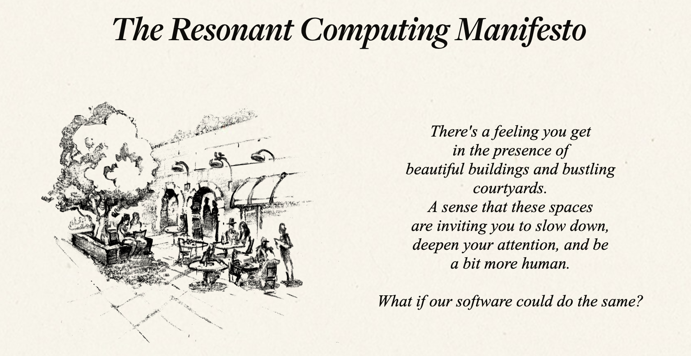

Last week, an exciting website appeared in my feeds: [The Resonant Computing Manifesto](https://resonantcomputing.org/).

The manifesto revolves around the idea that we are at a crossroads with AI. We can either double down on the direction we've already taken in our digital lives, a race to the bottom, or we can do something different. The goal is to build the most appealing digital junk food to maximize ad consumption and profits. This turns the internet into a few big platforms that are noisy and attention-seeking and don't serve customer needs. Big tech companies like TikTok, Facebook, and Instagram are pushing in this direction with full force, trying to use AI for hyper-personalization on their platforms.

The manifesto coined the term "resonance," which comes from the field of architecture (the architecture of real buildings, not software). It describes how we feel more at home and more human in certain environments. It is a quality without a name that is not strictly measurable and more intuitively graspable.

The manifesto suggests that AI can advance the current state of the internet and allow for new possibilities. This technology enables more hyper-personalized experiences **off** the major platforms because the technical requirements for one-size-fits-all solutions have disappeared.

The manifesto centers on five principles that resonate with my vision for [OnTree](https://ontree.co/):

1. A **private** experience on the Internet,
2. that is **dedicated** exclusively to each customer,
3. with no single entity controlling it (**Plural**),
4. **adaptable** to the specific needs of the customer,
5. and prosocial, making our offline lives better, too.

I love the whole piece. Of course, it's idealistic and probably sounds naive at first. However, I believe this world could use much more idealistic and naive believers in a new internet. Without these dreamers, nothing will change.

The only shortcoming I see is that the website doesn't address the consequences of people being "primary stewards of their own context." To me, this is impossible without a mindset shift away from passively being monetized and toward actively funding the software we want to succeed. Without making it clear that we must put our money where our mouth is, I feel this manifesto is incomplete.

Kagi.com is the perfect example here. Google's primary interest in search is always monetization. Therefore, it is logically impossible for them to want you to find what you're searching for on page one, spot one. Kagi.com has a far superior, ad-free search engine, and their main slogan is "Humanize the Web." With attractive family and duo plans, I find Kagi to be excellent value for the money, we pay less than four euros per family member per month.

To get a resonant internet, we have to pay the right companies the right amount of money.

(Source of the banner this time is [resonantcomputing.org](https://resonantcomputing.org/))

<!--LINKS_SEPARATOR-->

### AI escapes every moat VCs try to build

- **URL:** https://www.youtube.com/watch?v=CEvIs9y1uog
- **MyTake:** Kind of funny that AI so far escapes every moat the VC-backed try to build. Skills are just a Markdown file and a script usually and very powerful. Nice summary of the state of the art.
- **Keyword:** video

---

### Playwright supports logged in web pages

- **URL:** https://debbie.codes/blog/testing-logged-in-state-playwright-mcp-browser-extension/
- **MyTake:** Didn't know how well Playwright supports logged in web pages, will give it another try next week.
- **Keyword:** link

---

### RePebble: A ring that can capture your thoughts

- **URL:** https://repebble.com/index
- **MyTake:** A ring that can capture your thoughts, keeping all your data locally. Plain awesome, godspeed to RePebble!
- **Keyword:** link

---

### Kagi Hub: New office in Belgrade

- **URL:** https://blog.kagi.com/kagi-hub
- **MyTake:** It's almost impossible to not love Kagi. Now they're opening a new office which is bookable for free by all Kagi members in Belgrade!
- **Keyword:** link

---

### Mistral Vibe CLI

- **URL:** https://mistral.ai/news/devstral-2-vibe-cli
- **MyTake:** A new coding agent to check out: Mistral Vibe CLI. Just in time for the Christmas Holidays!
- **Keyword:** link

---

### Mistral's open source licensing approach

- **URL:** https://x.com/maziyarpanahi/status/1998426013144174955?s=12&t=6A6cLc3h1bwU1kn3jSDkrw
- **MyTake:** Mistral is getting a lot of hate for releasing their newest models open source, but with usage limitations for companies bigger than $20 million revenue. I don't get it, to me this makes a lot of sense.
- **Keyword:** link

---

### Anthropic donates MCP to independent foundation

- **URL:** https://aaif.io/
- **MyTake:** Anthropic donated the MCP protocol into an independent foundation. Not sure if this is good or just means we want to end supporting it at some point.
- **Keyword:** link

<!--PRINT_SEPARATOR-->

## What to Print This Week

### Wood Drain Soap Dish

Bambu is working really hard on me that I also want to buy a new printer that can laser through wood. Love these hybrid models, combining classical printing and woodcutting.

[visit model page](https://makerworld.com/en/models/2085275-wood-drain-soap-dish#profileId-2253704)

<!--FOOTER_SEPARATOR-->

## Hi 👋, I'm Stefan!

This is my weekly newsletter about technology becoming more fluid and adaptive - from rigid software to liquid tools that shape themselves to our needs. Feel free to forward this mail to people who should read it. If this mail was forwarded to you, please subscribe here, it's always 1 mail per week. https://liquid.engineer.

Stefan Munz, www.stefanmunz.com
