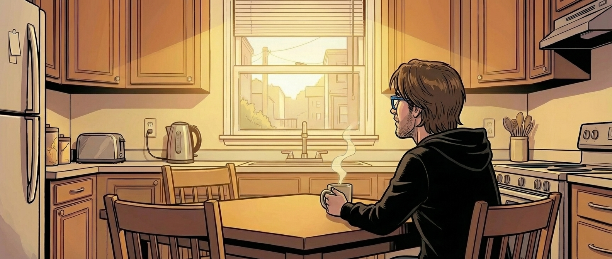

It's the week before Christmas. You're probably feeling the pressure to live up to all the expectations that Christmas brings each year. I hope you can let a few of them slide and choose to have a good time for a few hours in between.

From the outset, I have treated this newsletter as an experimental playground. I started out with lots of motivation for 3D printing, and I am still convinced it's a hugely powerful technology that will be adopted much more widely in the coming years. Then, even more interesting things happened: I switched my focus to agentic coding. In recent weeks, I've also incorporated a lot of content on local LLMs and the necessary software and hardware for this. This is because I'm trying to build a business in this area with [OnTree](https://ontree.co/).

Thank you for following me on this journey so far!

I realized that I write my best posts when I write about topics that interest me. I will continue to write this newsletter, but I won't be bound to any particular topics in the future. It might be about something that has just happened or something that I am currently working on. If you joined me for the AI content, I invite you to stick around over the next few weeks to see if you can still find value in the content. Since AI is keeping me busy, I expect there will still be plenty of AI-related content. If there's a topic you'd like to read about, just hit reply and let me know!

For the past few months, I have also been publishing the newsletter posts on my personal blog, [stefanmunz.com](https://www.stefanmunz.com/). If you prefer this method, feel free to dust off your old RSS reader and subscribe to my RSS feed!

Have a great Christmas with your loved ones!

Cheers, Stefan

<!--LINKS_SEPARATOR-->

### Desktop UX Deep Dive

- **URL:** https://www.youtube.com/watch?v=1fZTOjd_bOQ
- **MyTake:** Insightful deep dive into desktop UX by an industry veteran, full of anecdotes. He’s right: there’s no visible momentum for real evolution. I have high hopes for Google’s rumored Aluminium OS.
- **Keyword:** video

---

### OnTree.co Launch Video

- **URL:** https://www.youtube.com/watch?v=JdWgAdBHcHc
- **MyTake:** I launched OnTree.co this week and recorded a quick walkthrough showing the easiest way to start playing with it.
- **Keyword:** video

---

### 15 years XING

- **URL:** https://www.stefanimhoff.de/15-years-xing/
- **MyTake:** More layoffs at my former employer XING.com. Sad, but not surprising — the signs have been visible for a long time. Detailed report by a colleague affected in this round.
- **Keyword:** link

---

### Germany enters large-scale BESS era

- **URL:** https://www.energy-storage.news/germany-firmly-enters-large-scale-bess-era-with-enbw-vattenfall-and-enertrag-project-news/
- **MyTake:** We’re reaching a point in Germany where there’s so much solar power that large-scale battery projects kick off without needing direct subsidies (though there’s probably an indirect subsidy effect).
- **Keyword:** link

<!--PRINT_SEPARATOR-->

## What to Print This Week

<!--FOOTER_SEPARATOR-->

## Hi 👋, I'm Stefan!

This is my weekly newsletter about technology becoming more fluid and adaptive - from rigid software to liquid tools that shape themselves to our needs. Feel free to forward this mail to people who should read it. If this mail was forwarded to you, please subscribe here, it's always 1 mail per week. https://liquid.engineer.

Stefan Munz, www.stefanmunz.com
