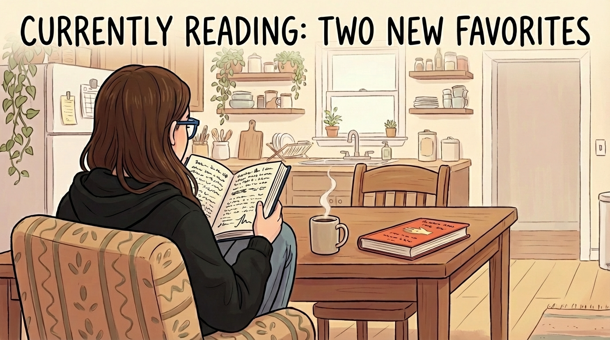

Two Book Recommendations: Sorry, No Happy Endings!

In 2026, this newsletter will cover a wider range of topics beyond AI and 3D printing. To kick off the new year, I want to share two books that have reshaped my thinking over the past year. Unfortunately, one is only available in German. The other is available in both English and German. 

Deutsche Militärgeschichte by Stig Förster

I read a [review of this book](https://www.sueddeutsche.de/kultur/militaergeschichte-stig-foerster-die-deutschen-kriege-bundeswehr-nva-li.3259092) in Süddeutsche Zeitung. As I'm not at all a fan of the military, it took me a while to download the sample to my Kindle app and start reading. At school, I never had a good history teacher and I always hated the subject. I mostly remember it as a boring game of memorising years without any connection between them, which my brain didn't want to remember. Like most brains, mine works better if there's a story, connection and reasoning included.

This book also mentions years, but it's not at all about exact dates. It's much more about the context of society at that time and the dynamics that often inevitably led to military conflicts. Stig Förster believes that the military is part of human organisation and that violent force is recurring, whether we want it or not. Having read it, I tend to agree, which unfortunately makes the outlook on the next decade grim.

Interestingly, the book covers the period from 1525 to 2025, continuing up to the present day and including the current conflict with Russia. Although I found the final chapters the most interesting, I found the entire 1,294-page book a surprisingly easy read. Although I studied World War I and World War II extensively at school, the book provided me with many new insights into these periods. For example, I learnt that the Nazi regime knew as early as 1941 that they would ultimately lose the war and adjusted their goals accordingly.

Buy as an [ebook at Thalia and you get an EPUB without any DRM measures](https://www.thalia.de/shop/home/artikeldetails/A1074438490).

How Countries Go Broke, The Big Cycle by Ray Dalio

Another book that I initially resisted starting to read. Ray Dalio is a major hedge fund manager. What could I possibly learn from a greedy finance guy whose only purpose in life is to maximise their own profits?

Quite a lot, as it turns out. It's also very much a history book, albeit a financial history book. The central claim is that economies go through a major cycle every 50 to 150 years. Our cycle began in 1950, after the Second World War, and is now in its final phase. The author doesn't just make this claim, but also presents extensive data from previous cycles, arguing that this knowledge is largely hidden because most people experience it only once in their lifetime.

He also offers a fascinating perspective on China, presenting it as more than just the evil state it is often portrayed as. It was a much harder read than Stig Förster because it contained a lot of information about the financial system that I hadn't come across before. If you're ever curious about macroeconomics, whether because of Bitcoin, debt, or what bonds are, you're in for a treat.

Buy here [at Thalia](https://www.thalia.de/shop/home/artikeldetails/A1071566441) or here [at Amazon](https://www.amazon.de/How-Countries-Go-Broke-Principles-ebook/dp/B0DT4X9FLG/ref=tmm_kin_swatch_0), both times with DRM.

I wish you a great start to 2026!

<!--LINKS_SEPARATOR-->

### what i learned this week

- **URL:** https://bits.logic.inc/p/ai-is-forcing-us-to-write-good-code
- **MyTake:** I couldn't agree more to this article and have the same observation: AI is forcing us to maintain top-notch code bases. Companies that optimize this way, will get much more out of their agents in 2026!
- **Keyword:** link

---

- **URL:** https://www.learnix-os.com/
- **MyTake:** Can somebody pause the world for two weeks, so that I can lock myself in and build my own operating system from scratch? POSIX compliant and in Rust? Please?
- **Keyword:** link

---

- **URL:** https://saanyaojha.substack.com/p/the-man-who-cant-be-moved
- **MyTake:** Listening to Yann LeCun is always a good idea, super curious what he's up to next. This is a good overview.
- **Keyword:** link

---

- **URL:** https://blog.exe.dev/meet-exe.dev
- **MyTake:** This is a concept I'd like to see more, I'd love to build this for OnTree.co. An agent-friendly sandbox that can turn itself into anything the user whishes. Whoever gets this right first is going to have a killer product.
- **Keyword:** link

<!--PRINT_SEPARATOR-->

## What to print this week

### CrankVac, your hand-powered vacuum cleaner

Fully 3D printed, no metal parts needed, tool-free assembly, 12 hours print time. Awesome name, just the design could be a bit more elegant.

[visit model page](https://makerworld.com/de/models/2118539-hand-powered-handheld-vacuum-cleaner-cyclone#profileId-2292927)
